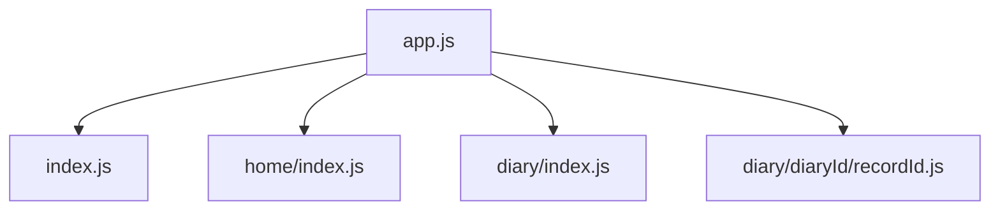
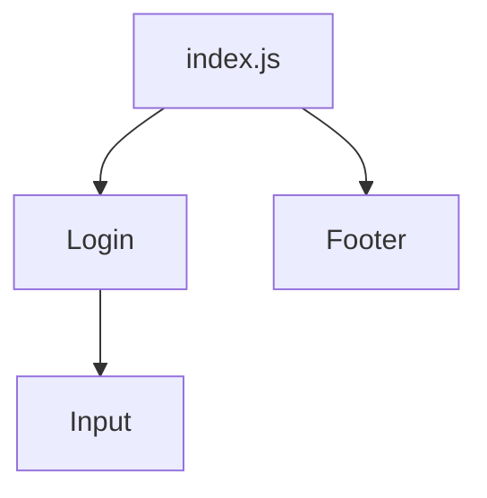
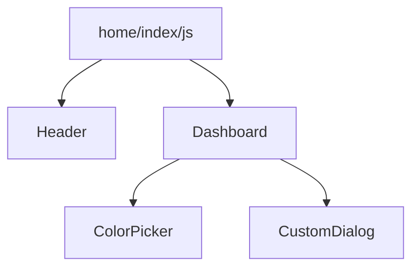
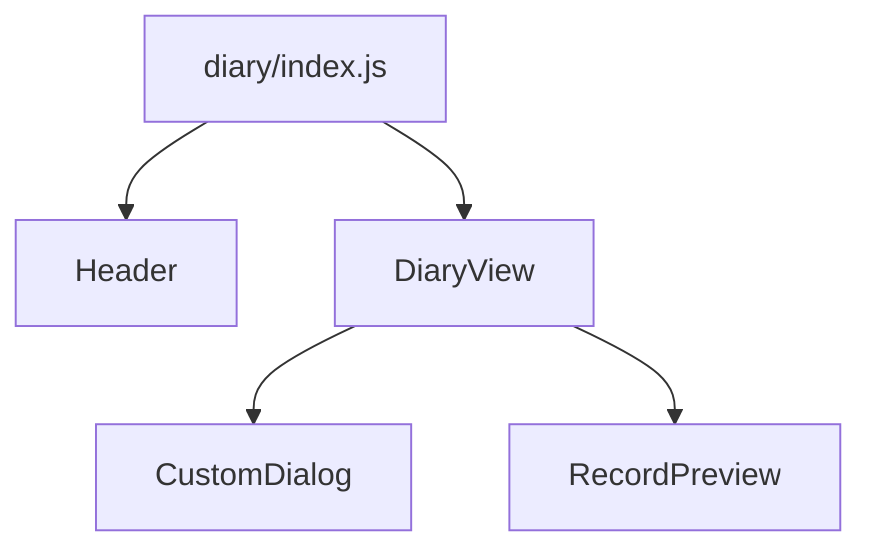
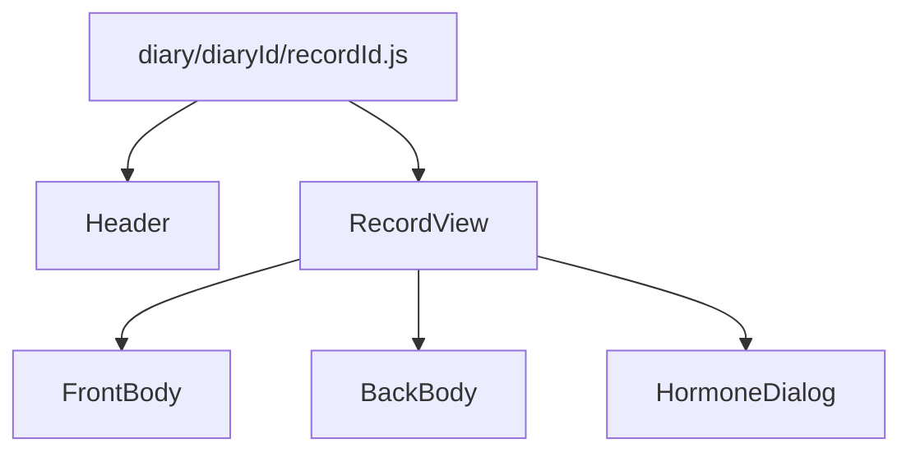
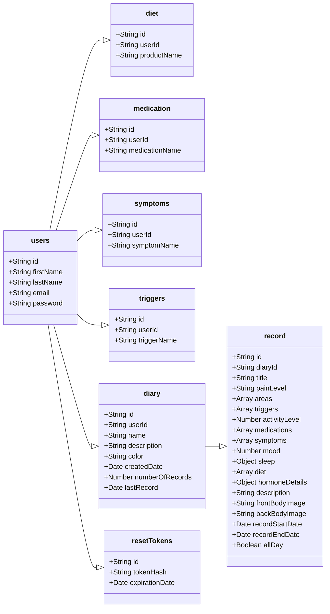

# Pain Catcher Documentation
---

| Revision | Updated    |
|----------|------------|
| 1.0.0    | 14/03/2022 |

## Table of Contents
- Framework
- Structure
	- Front-end
		- App.js
		- Index.js
		- home/index.js
		- diary/index.js
		- diary/diaryId/recordId.js
	- Back-end
		- Database model
		- API
			- /api/auth/signUp
			- /api/auth
			- /api/email
			- /api/email/check
			- /api/email/reset
			- /api/diary
			- /api/diary/add
			- /api/diary/modify
			- /api/diary/delete
			- /api/record
			- /api/record/single
			- /api/record/add
			- /api/record/edit
			- /api/record/editTime
			- /api/record/delete
- Installation
- Dependencies Information

## Framework

----
**Pain Catcher** application is built using Next.js framework which is based on React. Next.js is an end-to-end framework, therefore instead of having two separate instances running (front-end and back-end) and the need to deploy them independently, Next.js handles both in a single framework.

Although the frontend and backend are merged in one, they are going to be described separately in the following document for better structure.

## Structure
---
The application uses the following stack:  
- Next.js as the end-to-end framework
- MUI for building the front-end
- Node.js as the back-end framework
- MongoDB Atlas as the online cloud database

### Front-End
---
Front end for the application is built using MUI (formerly Material UI).  MUI is a library of HTML/CSS components similar to well-known Bootstrap.

Pain Catcher has the following front-end component structure:

#### App.js
---



#### Index.js
---


#### home/index.js
---



#### diary/index.js
---



#### diary/diaryId/recordId.js
---




### Back-End
---
#### Database Model
---



#### API
----
**/api/auth/signUp**

| Method | Body                                                      | Success                                                                            | Error                                      |
|--------|-----------------------------------------------------------|------------------------------------------------------------------------------------|--------------------------------------------|
| POST   | *{<br>firstName,<br>lastName,<br>email,<br>password<br>}* | 201: *{<br>code:201,<br>type:'success',<br>message:'Successfully registered'<br>}* | 422: *{<br>code,<br>type,<br>message<br>}* |

----
**/api/auth**

| Method | Body                           | Success                          | Error                    |
|--------|--------------------------------|----------------------------------|--------------------------|
| POST   | *{<br>email,<br>password<br>}* | 200: *{<br>jwt,<br>session<br>}* | 401: *{<br>message<br>}* |

----
**/api/email**

| Method | Body              | Success                                                                            | Error                                          |
|--------|-------------------|------------------------------------------------------------------------------------|------------------------------------------------|
| POST   | *{<br>email<br>}* | 200: *{<br>code:200,<br>type:'success',<br>message:'Email sent successfully'<br>}* | 404,500: *{<br>code,<br>type,<br>message<br>}* |

----
**/api/email/check**

| Method | Body                        | Success                                                                       | Error                                  |
|--------|-----------------------------|-------------------------------------------------------------------------------|----------------------------------------|
| POST   | *{<br>email,<br>token<br>}* | 200: *{<br>error:false,<br>message:'Provide new password',<br>id:userId<br>}* | 404,401: *{<br>error,<br>message<br>}* |

----
**/api/email/reset**

| Method | Body                        | Success                                                          | Error                                                                          |
|--------|-----------------------------|------------------------------------------------------------------|--------------------------------------------------------------------------------|
| POST   | *{<br>id,<br>password<br>}* | 200: *{<br>type:'success',<br>message:'Password was reset'<br>}* | 500: *{<br>type:'error',<br>message:'Error while resetting the password'<br>}* |

---
**/api/diary**

| Method | Body | Success                                    | Error                                      |
|--------|------|--------------------------------------------|--------------------------------------------|
| GET    | None | 200: *{<br>data,<br>type,<br>message<br>}* | 500: *{<br>data,<br>type,<br>message<br>}* |

----
**/api/diary/add**

| Method | Body                         | Success                                    | Error                                      |
|--------|------------------------------|--------------------------------------------|--------------------------------------------|
| POST   | *{<br>diary,<br>userId<br>}* | 200: *{<br>data,<br>type,<br>message<br>}* | 500: *{<br>data,<br>type,<br>message<br>}* |

----
**/api/diary/modify**

| Method | Body                                     | Success                                    | Error                                      |
|--------|------------------------------------------|--------------------------------------------|--------------------------------------------|
| PATCH  | *{<br>userId,<br>diaryId,<br>diary<br>}* | 200: *{<br>data,<br>type,<br>message<br>}* | 500: *{<br>data,<br>type,<br>message<br>}* |

----
**/api/diary/delete**

| Method | Body                           | Success                                    | Error                                      |
|--------|--------------------------------|--------------------------------------------|--------------------------------------------|
| DELETE | *{<br>userId,<br>diaryId<br>}* | 200: *{<br>data,<br>type,<br>message<br>}* | 500: *{<br>data,<br>type,<br>message<br>}* |

-----
**/api/record**

| Method | Body                                        | Success                                    | Error                                           |
|--------|---------------------------------------------|--------------------------------------------|-------------------------------------------------|
| POST   | *{<br>diaryId,<br>userId,<br>analysis<br>}* | 200: *{<br>data,<br>type,<br>message<br>}* | 401,500 : *{<br>data,<br>type,<br>message<br>}* |

----
**/api/record/single**

| Method | Body                                        | Success                                    | Error                                          |
|--------|---------------------------------------------|--------------------------------------------|------------------------------------------------|
| POST   | *{<br>userId,<br>diaryId,<br>recordId<br>}* | 200: *{<br>data,<br>type,<br>message<br>}* | 401,500: *{<br>data,<br>type,<br>message<br>}* |

----
**/api/record/add**

| Method | Body                                                                                | Success                                    | Error                                          |
|--------|-------------------------------------------------------------------------------------|--------------------------------------------|------------------------------------------------|
| POST   | *{<br>userId,<br>diaryId,<br>bodyAreas,<br>frontImage,<br>backImage,<br>dates<br>}* | 200: *{<br>data,<br>type,<br>message<br>}* | 401,500: *{<br>data,<br>type,<br>message<br>}* |

----
**/api/record/edit**

| Method | Body                                                                                 | Success                                    | Error                                          |
|--------|--------------------------------------------------------------------------------------|--------------------------------------------|------------------------------------------------|
| PATCH  | *{<br>userId,<br>diaryId,<br>record,<br>bodyAreas,<br>frontImage,<br>backImage<br>}* | 200: *{<br>data,<br>type,<br>message<br>}* | 401,500: *{<br>data,<br>type,<br>message<br>}* |

----
**/api/record/editTime**

| Method | Body                                                                                      | Success                                    | Error                                          |
|--------|-------------------------------------------------------------------------------------------|--------------------------------------------|------------------------------------------------|
| PATCH  | *{<br>userId,<br>recordId,<br>diaryId,<br>newStartDate,<br>newEndDate,<br>newAllDay<br>}* | 200: *{<br>data,<br>type,<br>message<br>}* | 401,500: *{<br>data,<br>type,<br>message<br>}* |

----
**/api/record/delete**

| Method | Body                                        | Success                                    | Error                                          |
|--------|---------------------------------------------|--------------------------------------------|------------------------------------------------|
| DELETE | *{<br>recordId,<br>userId,<br>diaryId<br>}* | 200: *{<br>data,<br>type,<br>message<br>}* | 401,500: *{<br>data,<br>type,<br>message<br>}* |

# Installation

----
1. Clone the provided repository from Github
2. Add the provided .env.local file into the root directory of the project
3. Open the Terminal and type:
```shell
npm install
```
or 
```shell
next dev
```

This will start installing the dependecies from the package.json and setting up the project. This could take some time.

4. Once all the dependecies are installed, the project can be run using the following command in the Terminal:
```shell
npm run dev
```

5. You can access the application from the browser using the address http://localhost:3000

# Dependencies Information
----
- @babel/preset-react - Javascript optimization for various new/old browsers 
----
- @emotion/react
- @emotion/style

Used by MUI for styling

----

- @fullcalendar/daygrid
- @fullcalendar/interaction
- @fullcalendar/luxon2
- @fullcalendar/react
- @fullcalendar/timegrid

Imports used for the calendar module

-------
- @mui/icons-material
- @mui/lab
- @mui/material

MUI dependencies

---
- bcrypt - used for encryption and decryption of data throughout the application
- luxon - date handling module for JavaScript
- mongoose - MongoDB object modelling module for Node.js
-----
- next
- next-auth
- next-transpile-modules

Next.js dependencies

-----
- nodemailer - module for handling SMTP mailing service
- randomcolor - module for generating random hex colors
- react-colorful - color picker module for React
- react-img-mapper - module used to map image areas to the specified values
- recharts - module to produce a variety of plots and graphs
- use-react-screenshot - module to take screenshot of the specified areas on the web page

----

- react
- react-dom

React dependencies

----
